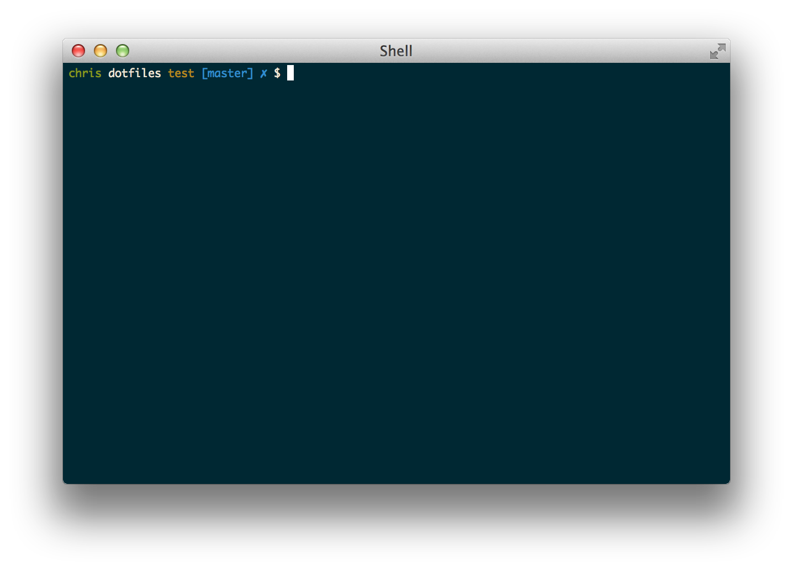

# dotfiles

Default prompts be damned!

Here are my super simple dotfiles for OS X and Linux systems. Kudos to [Adam Szatrowski](https://github.com/adam410) for getting me set up with iTerm2 and on my merry way, [Roger Lopez](https://github.com/zroger) and [Karina Ruzinov](https://github.com/karina) for getting me addicted to VIM, and [Jeff Uthaichai](https://github.com/jeffu) for the global gitignore info.

* green is current user
* grey is present working directory
* yellow is current virtualenv (see postactivate script to hook into virtualenv)
* blue is current git branch with `✗` for out of sync

### vim

* `,d` brings up [NERDTree](https://github.com/scrooloose/nerdtree), a sidebar buffer for navigating and manipulating files
* `,t` brings up [ctrlp.vim](https://github.com/kien/ctrlp.vim), a project file filter for easily opening specific files
* `,b` restricts ctrlp.vim to open buffers
* `,a` starts project search with [ag.vim](https://github.com/rking/ag.vim) using [the silver searcher](https://github.com/ggreer/the_silver_searcher) (like ack, but faster)
* `,g` toggles gitgutter
* `\\\` toggles current line comment
* `\\` toggles visual selection comment lines
* `vii`/`vai` visually select *in* or *around* the cursor's indent
* `<C-k>`/`<C-l>` move between windows